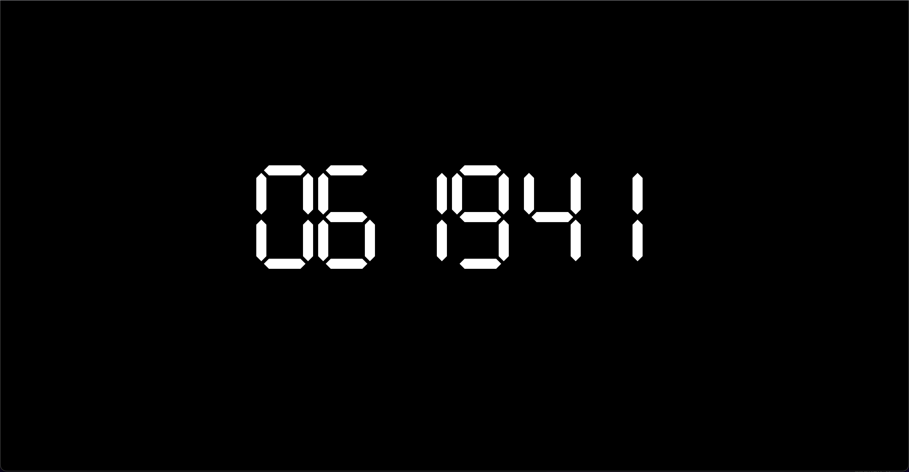

# Digital Clock

**Reloj Digital minimalista** 

    - Muestra horas, minutos, segundos
    
    - Hecho solo con html, css y javascript

    - Hecho para pantallas grandes

    - Se actualiza segundo a segundo

    - Estilo de reloj con pantalla lcd 

Puedes ver el resultado en linea [aqui](https://raymundosantorski.github.io/digitalClock/).

